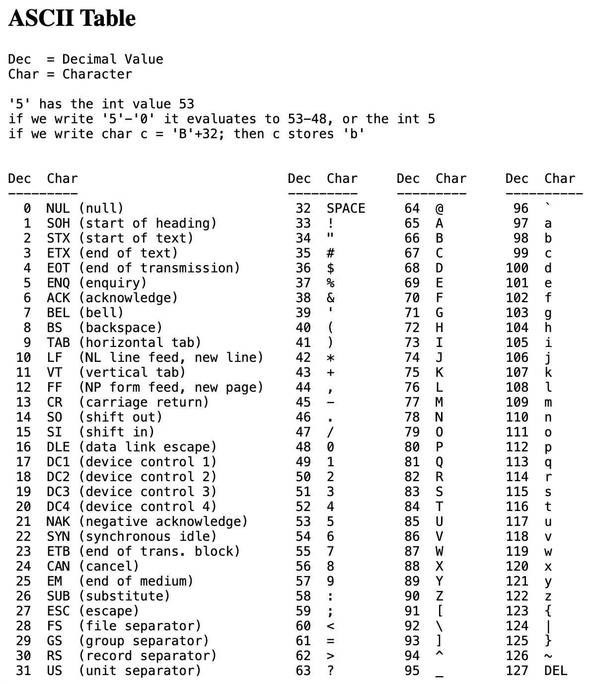
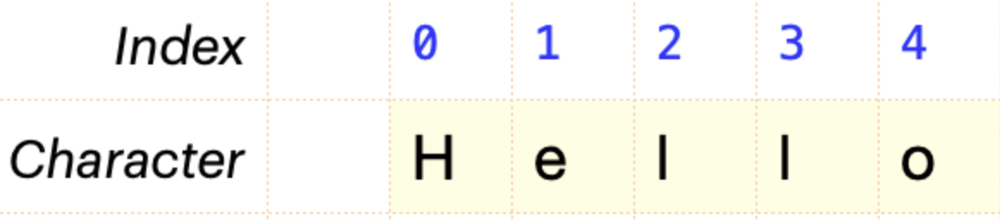

# String Objects

### What is a String?

A string is a *sequence of characters* that is stored in memory. Strings are object type variables, which means they hold more than a single value in memory. In fact, strings store a sequence of characters as well as methods that operate on those characters when they are stored in memory. 

JavaScript supports two syntax options for strings - we can use double quotes or single quotes to hold string values. For this class, we will use double quotes. 

All possible characters that can be included in a string value are listed in the **ASCII Table**. The ASCII Table is a table of values that computers use to translate electrical data (1's and 0's) into characters that we can read by humans. Part of the ASCII table is shown below. 



Notice that every character on the ASCII table (under the *Char* heading) has a corresponding decimal value associated with it (under the *Dec* heading). For example, a capital **J** character has a decimal value of 74. 

We should note that capitalized characters are unique values on the ASCII table, as are lowercase characters. Captial J (value 74) is different than lowercase j (value 106). 

Additionally, there are special characters that have ASCII values. For example, the **SPACE** character has a decimal value of 32, and a new line character **\n**, also known as a *carriage return*, has a decimal value of 13. 

We also see that number characters are respresented on the ASCII table. For example, the **7** character has a decimal value of 55. This makes sence since we know that a number value of 7 is different than a string "7" in programming. 

Every string value is made up of zero or more of these characters. The empty string ```""``` is the only string that has zero characters. 

### String Indexing

Every character of a string has an *index* associated with it. The index of a character is the position of that character within the string. Index values start at zero for the leftmost character, and increase by one as we move to the right. Consider the image shown below.



Notice that the string "Hello" has a total of 5 characters. The index of the first character, capital H, is index zero. The next character, lowercase e, is at index one.

### Wrap Up
Strings are one of the most useful and common datatypes in all of programming. We've seen in previous lessons that all data entered in a prompt comes into our program as a string value. This makes sense since strings can hold any character, which means that any data can be represented inside a string. 

That said, we now need to understand how to manipulate string values. There are numerous methods associated with strings that we need to be familiar with. We will cover those in the next note document. 
