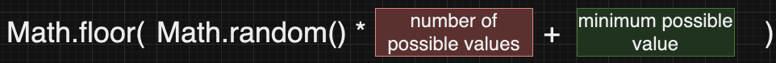

# Random Numbers

### Purpose

Generating random numbers is a key concept in programming applications. Random numbers are heavily utilized in video games, games of chance (casino games), and a variety of other software applications. 

There are many techniques that can be used to generate random numbers. We will focus on using the ```Math.random()``` method to generate random numbers. 

### Random Number Generation 

We will use the following procedure to generate random numbers (integers) in JavaScript. 



Let's break this code down to see why it works. Recall that JavaScript executes methods in an inside-out order, similar to mathematics. Therefore, the statements inside the parenthesis will execute first. 

**Order of Execution:**

```Math.random()``` will execute first, generating a random floating-point value from 0.0 to 0.999 (repeating). 

Next, the random floating-point value will be multiplied by the **number of possible values** because multiplication takes priority over addition in math operations. 

Finally, the **minimum possible value** will be added (or subtracted) from the result of the multiplication. 

Now that the internal calculation is done, ```Math.floor()``` will round the resulting value down, producting an integer value. This integer is the final result for the random value we want to generate.


### Random Number Generation - Code Example

The following code snippets are examples of using random number generation with a variety of values. 

```javascript
// Generate a random number from 1 - 6
// # of values: 6, minimum value: 1
let random1 = Math.floor(Math.random()*6+1);

// Generate a random number from 2 - 5
// # of values: 4, minimum value: 2
let random2 = Math.floor(Math.random()*4+2);

// Generate a random number from -3 - 6
// # of values: 10, minimum value: -3
let random3 = Math.floor(Math.random()*10-3);
```

### Wrap Up

Random number generation is a key component to many programming applications. There are other ways to generate random numbers in JavaScript. These notes cover one common approach that we will use moving forward.
